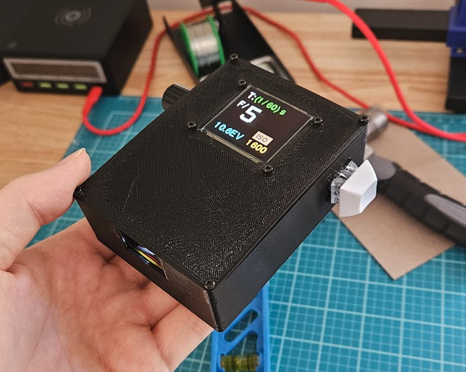
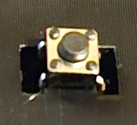
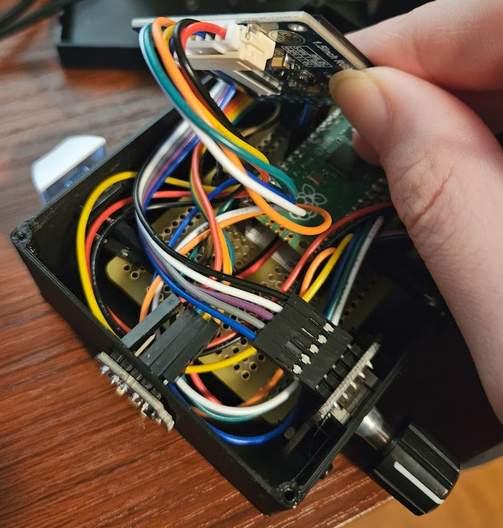
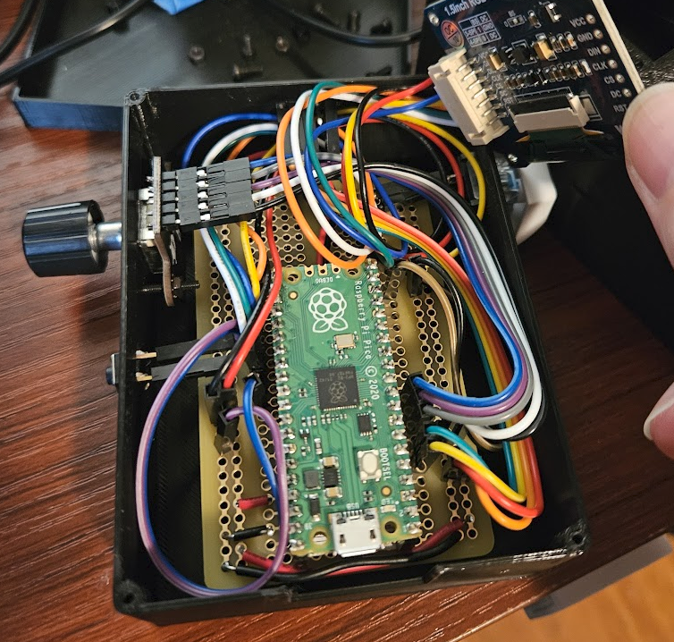
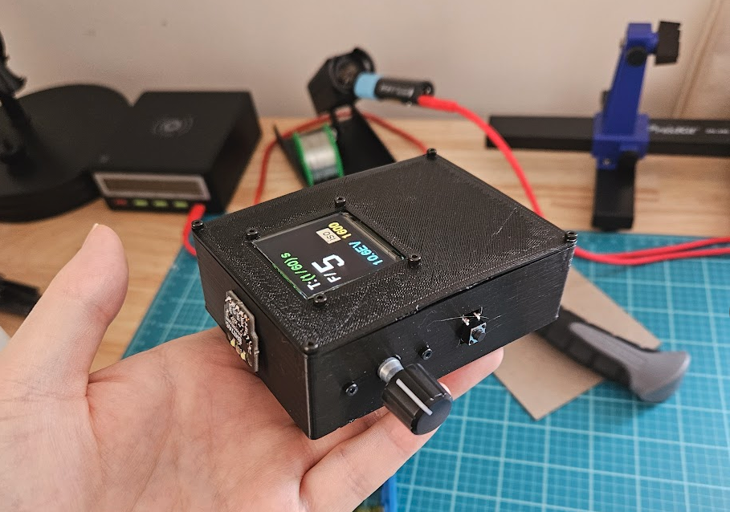

# Literally-a-box case

A case made to be as simple and easy to assemble as possible. Good for beginners. Each part is connected using headers, making each easy to replace. Might be a good base for any prototyping or development of new features.

## Components used

- [ ] BH1745 Light Sensor (PIM375) [US Link](https://www.mouser.com/ProductDetail/Pimoroni/PIM375?qs=lc2O%252BfHJPVYnjhqxx6C0qg%3D%3D)
- [ ] EC11 Rotary Encoder Module (SEN0235) [US Link](https://www.mouser.com/ProductDetail/DFRobot/SEN0235?qs=0lQeLiL1qyZ%252B1XtMnUlo%2FQ%3D%3D)
- [ ] Raspberry Pi Pico with Headers (RP2040) [US Link](https://www.adafruit.com/product/4864)
- [ ] LiPo Power SHIM for Raspberry Pi Pico (PIM557) [US Link](https://www.adafruit.com/product/5612)
- [ ] Kailh Blue Mechanical Switch (Any MX compatible switch)
- [ ] MX compatible keycap
- [ ] Tactile Button Switch (6mm)
- [ ] Lithium Ion Battery (3.7v 2000mAh) [US Link](https://www.adafruit.com/product/2011)
- [ ] Adafruit Perma-Proto Half-sized Breadboard PCB [US Link](https://www.adafruit.com/product/1609)
- [ ] Waveshare 128x128 full color OLED screen
- [ ] Assorted M2 screws and nuts
- [ ] A bunch of female-to-male jumper wires
- [ ] Stacking Headers for Raspberry Pi Pico - 2 x 20 Pin  

## Assembly notes

- The encoder should be inserted first as the PCB would otherwise block it. Depending on your 3d printer, the encoder cutout may need to be widened. Hold down the encoder using M2 screws and nuts.
- Header pins were soldered to the mechanical switch and button.
- The legs for the 6mm button snap into the holes below the encoder.\
  
- The headers for the BH1745 snap into the cutout on top of the case. It may need to be glued down if it doesn't sit properly. Perhaps a screw hole mount can be added to the design in the future.
- The MX compatible switch snaps into the hole on the right side.
- Place the battery between the PCB standoffs, attach it to the Pico and SHIM combo. Then place the PCB on top of the battery and screw it down to the standoffs. Seat the Pico to the headers on the PCB.
- I soldered the male jumpers to the PCB, I wouldn't recommend this as it causes the case to barely close.
- The grooves in the cover are to keep the sides of the box from bowing in.
- The screen should fit perfectly flush against the cover.

## CAD file

[Link to onshape document](https://cad.onshape.com/documents/9e4b3a8f5e44a9591b21eb00/w/015ee63366da5d3616845d4b/e/118922b18db69dfec9275897)

## Gallery

